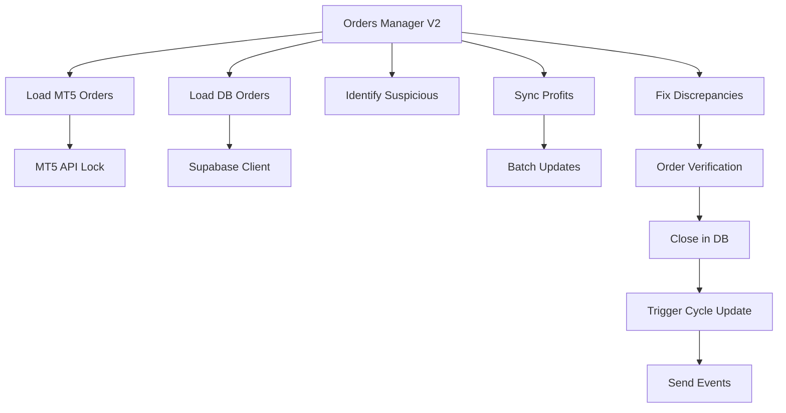
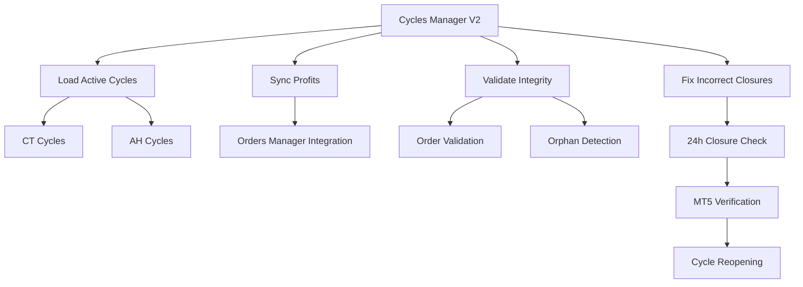

# Orders Manager V2 and Cycles Manager V2 Documentation

## Overview

The Real-Time Trading System V2 includes two critical management components that operate in the background to maintain data integrity and system health:

1. **Orders Manager V2** - Manages order synchronization between MT5 and Supabase
2. **Cycles Manager V2** - Manages cycle lifecycle and validation across strategies

Both managers operate independently with their own update intervals and error handling, providing robust, fault-tolerant management of trading data.

---

## Orders Manager V2

### Purpose

The Orders Manager V2 ensures that order data between MetaTrader 5 and the Supabase database remains synchronized in real-time. It handles:

- Real-time order profit updates
- Detection and correction of discrepancies
- Order closure validation
- MT5 ↔ Database synchronization

### Key Features

#### Real-Time Synchronization

- **Update Interval**: 500ms for optimal performance vs accuracy balance
- **Parallel Processing**: Concurrent MT5 and Supabase data loading
- **Smart Updates**: Only updates orders with significant profit changes (>1 cent)
- **Event-Driven**: Sends events for order lifecycle changes

#### Discrepancy Detection

- **Suspicious Orders**: Orders in database but not in MT5
- **False Closed Orders**: Orders marked open in DB but closed in MT5
- **Verification System**: Double-checks with MT5 before making changes
- **Automated Correction**: Fixes discrepancies automatically

#### Performance Optimization

- **Threading Locks**: Prevents MT5 API conflicts
- **Connection Pooling**: Efficient database operations
- **Batch Updates**: Groups multiple updates for efficiency
- **Statistics Tracking**: Monitors performance and health

### Architecture



### Key Methods

#### Core Operations

```python
async def run_order_manager():
    """Main order management loop"""
    # Runs continuously every 500ms
    # 1. Load orders from MT5 and Supabase
    # 2. Identify suspicious orders
    # 3. Sync profits and fix issues
```

#### Data Loading

```python
async def load_mt5_orders():
    """Load all open positions from MT5"""
    # Thread-safe MT5 API access
    # Extracts: ticket, symbol, profit, swap, commission

async def load_db_orders():
    """Load all executed orders from Supabase"""
    # Filters by account and status
    # Includes order_data and cycle relationships
```

#### Synchronization

```python
async def sync_orders_to_db():
    """Sync order profits from MT5 to database"""
    # Updates only significantly changed profits
    # Batch processing for efficiency

async def fix_suspicious_orders():
    """Fix orders that appear closed in MT5"""
    # Verifies closure with MT5
    # Updates database status
    # Triggers cycle recalculation
```

### Configuration

```python
class OrdersManagerV2:
    def __init__(self, meta_trader, supabase_client, account_id):
        # Performance settings
        self.update_interval = 0.5  # 500ms
        self.profit_threshold = 0.01  # 1 cent minimum change

        # Threading and safety
        self.mt5_lock = threading.Lock()
```

### Events Generated

1. **ORDER_CLOSED_BY_MT5** - Order automatically closed
2. **ORDER_MANUALLY_CLOSED** - Order closed by user/system
3. **ORDER_CLOSE_FAILED** - Failed to close order
4. **CYCLE_RECALCULATE_PROFIT** - Trigger cycle profit update

---

## Cycles Manager V2

### Purpose

The Cycles Manager V2 maintains the integrity and lifecycle of trading cycles across all strategies. It handles:

- Cycle data synchronization
- Profit calculation and validation
- Data integrity checks
- Incorrect closure detection and correction

### Key Features

#### Intelligent Cycle Management

- **Strategy Detection**: Automatically identifies CT vs AH cycles
- **Dynamic Loading**: Creates appropriate cycle objects on-demand
- **Real-Time Profit Sync**: Updates cycle profits based on order changes
- **Lifecycle Management**: Handles creation, updates, and closure

#### Data Integrity Validation

- **Order Validation**: Ensures all referenced orders exist
- **Orphan Detection**: Finds orders linked to cycle but not in cycle lists
- **Missing Order Cleanup**: Removes references to deleted orders
- **Relationship Integrity**: Maintains proper cycle-order relationships

#### Advanced Validation

- **24-Hour Closure Check**: Validates recently closed cycles
- **MT5 Cross-Reference**: Checks if "closed" cycles have open orders
- **Automatic Reopening**: Reopens incorrectly closed cycles
- **Comprehensive Logging**: Detailed validation reporting

### Architecture



### Key Methods

#### Core Operations

```python
async def run_cycles_manager():
    """Main cycles management loop"""
    # Runs every 1 second
    # 1. Load and sync cycles
    # 2. Validate data integrity
    # 3. Fix incorrect closures (every 30s)
```

#### Cycle Management

```python
async def load_active_cycles():
    """Load all active cycles from Supabase"""
    # Determines cycle type (CT vs AH)
    # Creates appropriate cycle objects
    # Updates existing cycles with latest data

async def sync_cycle_profits():
    """Sync cycle profits with order status"""
    # Gets orders from Orders Manager
    # Calculates current profit and volume
    # Updates cycles with significant changes
```

#### Data Integrity

```python
async def validate_cycle_integrity():
    """Validate cycle-order relationships"""
    # Checks order existence
    # Finds orphaned orders
    # Fixes missing references

async def fix_incorrectly_closed_cycles():
    """Fix cycles marked closed with open orders"""
    # Checks last 24 hours of closed cycles
    # Verifies with MT5 order status
    # Reopens cycles with active orders
```

### Configuration

```python
class CyclesManagerV2:
    def __init__(self, meta_trader, supabase_client, account_id, orders_manager):
        # Performance settings
        self.update_interval = 1.0  # 1 second
        self.validation_interval = 30  # 30 seconds

        # Integration
        self.orders_manager = orders_manager  # For profit sync
```

### Cycle Type Detection

The manager automatically detects cycle types:

```python
# AdaptiveHedging cycles
if ('hedge_levels' in cycle_data and cycle_data['hedge_levels']) or cycle_type == 'HEDGE':
    ah_cycle = AHCycleV2(...)

# CycleTrader cycles
else:
    ct_cycle = CTCycleV2(...)
```

### Events Generated

1. **CYCLE_REOPENED** - Incorrectly closed cycle reopened
2. **CYCLE_RECALCULATE_PROFIT** - Profit recalculation triggered
3. **SYSTEM_HEALTH** - Regular health status reports

---

## Integration with Main System

### System Startup Sequence

1. **Core Services**: Supabase and MT5 connections
2. **Orders Manager**: Starts order synchronization
3. **Cycles Manager**: Starts cycle management (depends on Orders Manager)
4. **Strategies**: Start trading strategies (use both managers)

### Task Management

Both managers run as independent asyncio tasks:

```python
# Orders Manager task
orders_task = asyncio.create_task(
    self.orders_manager.start(),
    name="OrdersManager"
)

# Cycles Manager task
cycles_task = asyncio.create_task(
    self.cycles_manager.start(),
    name="CyclesManager"
)
```

### Health Monitoring

The main system monitors manager health:

- **Task Status**: Checks if managers are running
- **Performance Stats**: Tracks sync counts and errors
- **Automatic Restart**: Restarts failed managers
- **Error Reporting**: Logs manager issues

### Statistics and Monitoring

#### Orders Manager Stats

```python
{
    'mt5_orders_count': 45,
    'db_orders_count': 43,
    'suspicious_orders_count': 2,
    'total_syncs': 1250,
    'total_errors': 3,
    'fixed_orders': 8
}
```

#### Cycles Manager Stats

```python
{
    'total_active_cycles': 12,
    'ct_cycles_count': 8,
    'ah_cycles_count': 4,
    'ct_total_profit': 1250.75,
    'ah_total_profit': -320.25,
    'total_profit': 930.50,
    'cycles_created': 45,
    'cycles_closed': 33,
    'fixed_cycles': 2
}
```

---

## Error Handling and Recovery

### Orders Manager Recovery

1. **MT5 Connection Loss**: Retries with exponential backoff
2. **Database Errors**: Continues operation, logs errors
3. **Data Inconsistencies**: Validates with multiple sources
4. **Performance Issues**: Adjustable update intervals

### Cycles Manager Recovery

1. **Missing Orders**: Removes invalid references
2. **Orphaned Data**: Repairs cycle-order relationships
3. **Incorrect States**: Cross-validates with MT5
4. **Performance Degradation**: Optimized batch operations

### System-Level Recovery

1. **Manager Failures**: Automatic restart with fresh state
2. **Cascade Effects**: Isolates failures between components
3. **Data Corruption**: Validates and repairs on startup
4. **Resource Exhaustion**: Monitors and throttles operations

---

## Performance Characteristics

### Orders Manager Performance

- **Update Frequency**: 2 updates per second (500ms intervals)
- **Throughput**: Handles 100+ orders efficiently
- **Latency**: Sub-100ms order updates
- **Memory Usage**: ~50MB for typical account
- **CPU Usage**: <5% on modern systems

### Cycles Manager Performance

- **Update Frequency**: 1 update per second
- **Validation Frequency**: Every 30 seconds
- **Throughput**: Handles 50+ active cycles
- **Latency**: Sub-200ms cycle updates
- **Memory Usage**: ~30MB for typical account

### Combined System Performance

- **Total Memory**: ~150MB including strategies
- **Database Connections**: Optimized connection pooling
- **Network Efficiency**: Batch operations and filtering
- **Scalability**: Handles multiple accounts independently

---

## Best Practices

### Configuration

- Set appropriate update intervals based on trading frequency
- Monitor system resources and adjust accordingly
- Use proper logging levels for production vs development

### Monitoring

- Track key performance metrics regularly
- Set up alerts for error thresholds
- Monitor database connection health

### Maintenance

- Regular log rotation and cleanup
- Periodic validation of data integrity
- Update frequency adjustment based on market conditions

---

## Troubleshooting

### Common Issues

#### Orders Manager

1. **High Suspicious Order Count**: Check MT5 connection stability
2. **Slow Updates**: Reduce update frequency or check database performance
3. **Memory Growth**: Verify proper cleanup of closed orders

#### Cycles Manager

1. **Missing Cycles**: Check Supabase query filters and permissions
2. **Profit Discrepancies**: Verify Orders Manager integration
3. **Validation Failures**: Review cycle-order relationship integrity

### Debugging Tools

1. **Manager Statistics**: Use `get_order_statistics()` and `get_cycle_statistics()`
2. **Force Sync**: Use `force_order_sync()` for immediate synchronization
3. **Manual Validation**: Use integrity validation methods individually
4. **Event Logs**: Monitor Supabase events table for system activity

### Log Analysis

Key log patterns to monitor:

- `Order sync #N: X MT5 orders, Y DB orders` - Regular sync status
- `Fixed N suspicious orders` - Discrepancy corrections
- `Cycle sync #N: X active cycles` - Cycle management status
- `Fixed N incorrectly closed cycles` - Cycle corrections

This comprehensive management system ensures data integrity, real-time performance, and fault tolerance across all trading operations.
