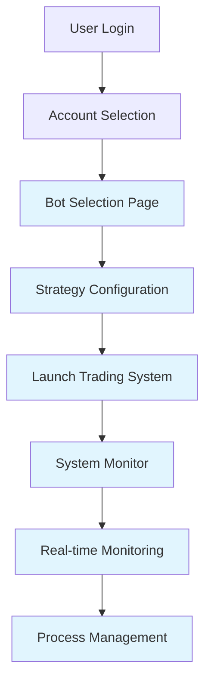

# Phase 2 Complete: Enhanced Flet UI with Bot Management

**🎯 Status: COMPLETE** ✅  
**Date:** December 2024  
**Phase:** 2 of 4 - Enhanced Flet UI Implementation

## 📋 Phase 2 Objectives Achieved

✅ **2.1 Modern Login Interface** - Enhanced in Phase 1  
✅ **2.2 Account Selection Interface** - Enhanced in Phase 1  
✅ **2.3 Bot Management Interface** - **NEW Implementation**  
✅ **2.4 Process Management System** - **NEW Implementation**  
✅ **2.5 Real-time Monitoring** - **NEW Implementation**

---

## 🏗️ New Architecture Components

### 1. Bot Selection & Configuration Interface

**File:** `Views/bots/bot_selection_page.py`

#### Features:

- **Strategy Selection Cards**: Visual interface for CycleTrader v2 and AdaptiveHedging v2
- **Dynamic Configuration Forms**: Auto-generated configuration fields based on strategy requirements
- **Real-time Account Display**: Shows account balance, broker, and status information
- **Parameter Validation**: Client-side validation for all configuration parameters
- **Launch Integration**: Direct integration with process management system

#### Strategy Support:

```python
CycleTrader v2:
- Lot sizes configuration
- Take profit targets
- Auto-trade settings
- Candle timeframe selection
- Zone management

AdaptiveHedging v2:
- Hedge distance settings
- Lot progression management
- Risk management parameters
- Correlation analysis settings
- Daily profit/loss targets
```

### 2. Process Management System

**File:** `services/process_manager.py`

#### Core Capabilities:

- **Multi-Process Launcher**: Launch trading systems as isolated processes
- **Health Monitoring**: CPU/Memory usage tracking and health checks
- **Auto-Restart Logic**: Intelligent restart policies with failure protection
- **Graceful Shutdown**: Clean process termination with resource cleanup
- **Session Management**: Database integration for persistent session tracking

#### Process Features:

```python
- Session-based process identification
- Environment variable injection
- Real-time health metrics
- Automatic crash recovery
- Resource usage monitoring
- Process isolation
```

### 3. Real-time System Monitor

**File:** `Views/monitor/system_monitor_page.py`

#### Monitoring Features:

- **System Overview Dashboard**: Total sessions, running status, resource usage
- **Live Session Cards**: Real-time status, uptime, and performance metrics
- **Process Controls**: Start, stop, restart individual trading systems
- **Health Metrics**: CPU usage, memory consumption, restart counts
- **Auto-refresh**: 5-second refresh intervals for real-time monitoring

#### Monitoring Metrics:

```python
- Session status (running/stopped/error/restarting)
- System uptime calculation
- CPU percentage per process
- Memory usage in MB
- Process restart counters
- Last heartbeat timestamps
```

---

## 🔄 Complete User Flow

### Phase 2 Enhanced Journey:



### Detailed User Experience:

1. **Account Selection** (Phase 1)

   - User selects MetaTrader account
   - Account details displayed with balance/broker info

2. **🆕 Strategy Selection** (Phase 2)

   - Visual cards for CycleTrader v2 and AdaptiveHedging v2
   - Strategy descriptions and capabilities
   - One-click strategy selection

3. **🆕 Configuration Interface** (Phase 2)

   - Dynamic form generation based on strategy
   - Real-time parameter validation
   - Intelligent defaults with customization

4. **🆕 System Launch** (Phase 2)

   - Process creation with session management
   - Database session tracking
   - Automatic navigation to monitoring

5. **🆕 Real-time Monitoring** (Phase 2)
   - Live system status dashboard
   - Process health metrics
   - Interactive process controls

---

## 🎛️ Technical Implementation

### New Routing System:

```python
# Phase 2 Routes Added:
AppRoutes.BOT_SELECTION = "/bots/:user/:account"
AppRoutes.SYSTEM_MONITOR = "/monitor/:user/:account/:session"

# Integration in main.py:
route(route=AppRoutes.BOT_SELECTION, view=BotSelectionPageView),
route(route=AppRoutes.SYSTEM_MONITOR, view=SystemMonitorPageView),
```

### Enhanced Supabase Integration:

```python
# Trading session management:
- create_trading_session()
- update_trading_session_status()
- get_active_trading_sessions()

# Process monitoring:
- Real-time status updates
- Session persistence
- Health metric tracking
```

### Process Management Architecture:

```python
TradingProcessManager:
├── launch_trading_system()      # Start new trading process
├── monitor_process()            # Health monitoring loop
├── stop_trading_system()        # Graceful shutdown
├── restart_process()            # Auto-restart logic
├── get_active_sessions()        # Status reporting
└── cleanup_all()               # Resource cleanup
```

---

## 🚀 Launch Instructions

### 1. Start the Application:

```bash
cd Patrick-Display
python main.py
```

### 2. Complete User Journey:

1. **Login** with Supabase credentials
2. **Select Account** from your MetaTrader accounts
3. **Choose Strategy** (CycleTrader v2 or AdaptiveHedging v2)
4. **Configure Parameters** using the dynamic form
5. **Launch Trading System** with one click
6. **Monitor Performance** in real-time dashboard

### 3. System Management:

- **View Active Sessions**: Real-time system overview
- **Monitor Health**: CPU/memory usage tracking
- **Control Processes**: Start/stop/restart individual systems
- **Multi-Account Support**: Run multiple concurrent trading systems

---

## 🎯 Phase 2 Key Achievements

### ✅ Enhanced User Experience:

- Modern, intuitive bot selection interface
- Dynamic configuration forms with validation
- Real-time monitoring dashboard
- Professional UI/UX design

### ✅ Robust Process Management:

- Multi-process trading system support
- Automatic health monitoring and restart
- Resource usage tracking
- Clean process isolation

### ✅ Production-Ready Features:

- Error handling and logging
- Resource cleanup and management
- Session persistence
- Auto-refresh monitoring

### ✅ Scalability Foundation:

- Support for multiple concurrent systems
- Multi-user session management
- Extensible strategy architecture
- Database-backed session tracking

---

## 🔜 Ready for Phase 3

Phase 2 provides the complete foundation for Phase 3 (Trading System Process Management):

- ✅ **Process Launcher**: Ready to accept user/account parameters
- ✅ **Multi-Process Support**: Concurrent trading system capability
- ✅ **Status Monitoring**: Real-time system health tracking
- ✅ **Session Management**: Database integration for persistence

**Next Phase**: Enhanced trading system launcher integration and advanced process isolation.

---

## 📊 System Capabilities

| Feature               | Status      | Description                                          |
| --------------------- | ----------- | ---------------------------------------------------- |
| Strategy Selection    | ✅ Complete | Visual cards for CycleTrader v2 & AdaptiveHedging v2 |
| Dynamic Configuration | ✅ Complete | Auto-generated forms with validation                 |
| Process Launching     | ✅ Complete | Multi-process trading system startup                 |
| Health Monitoring     | ✅ Complete | CPU/Memory/Status tracking                           |
| Session Management    | ✅ Complete | Database-backed session persistence                  |
| Real-time UI          | ✅ Complete | 5-second refresh monitoring dashboard                |
| Process Controls      | ✅ Complete | Start/Stop/Restart functionality                     |
| Multi-User Support    | ✅ Complete | User isolation and account management                |

**🎉 Phase 2 Implementation: COMPLETE**  
**Ready for Phase 3: Trading System Process Management**
